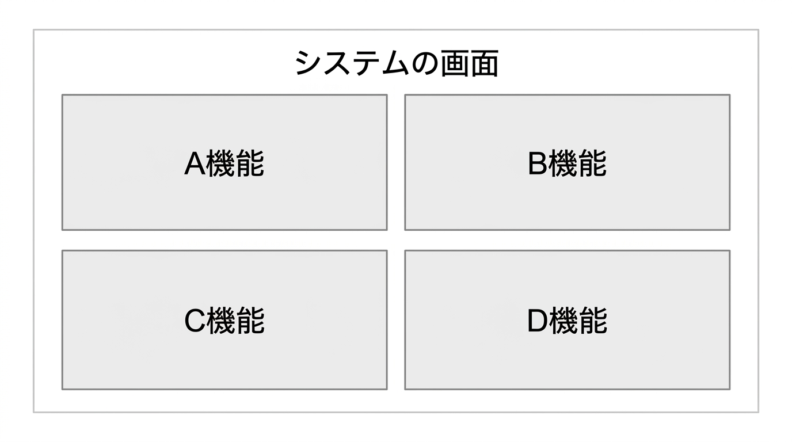
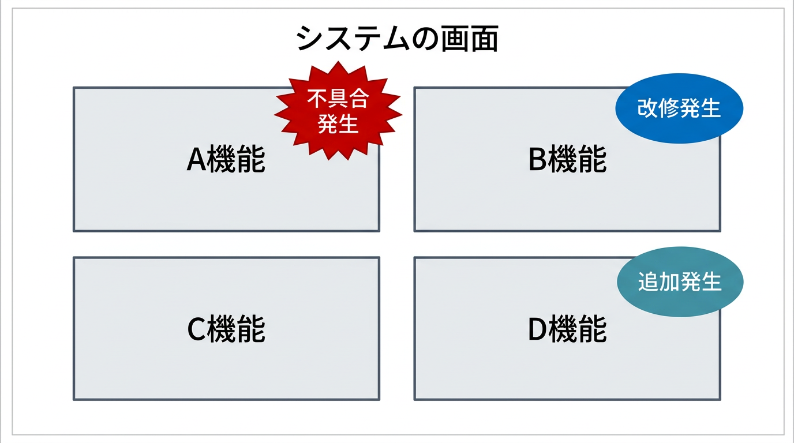
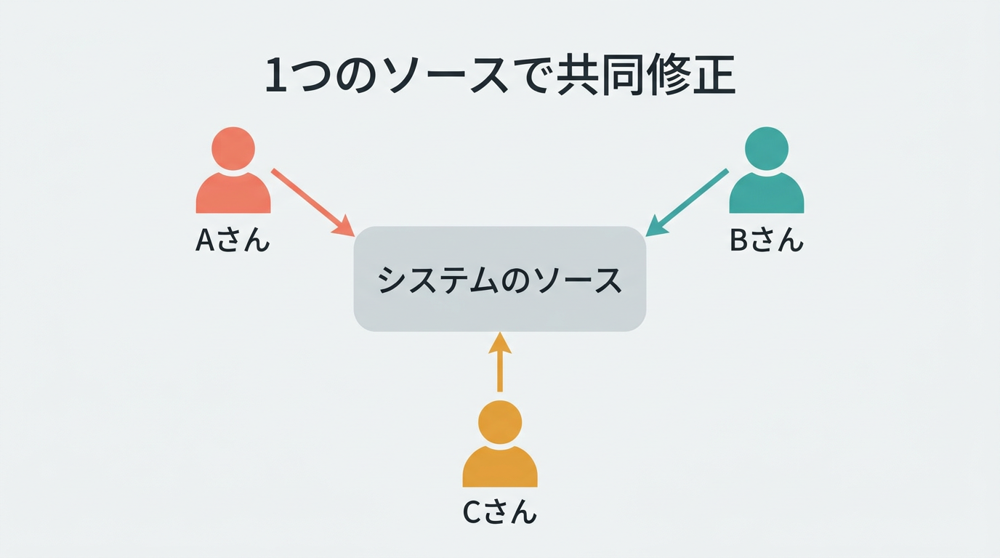
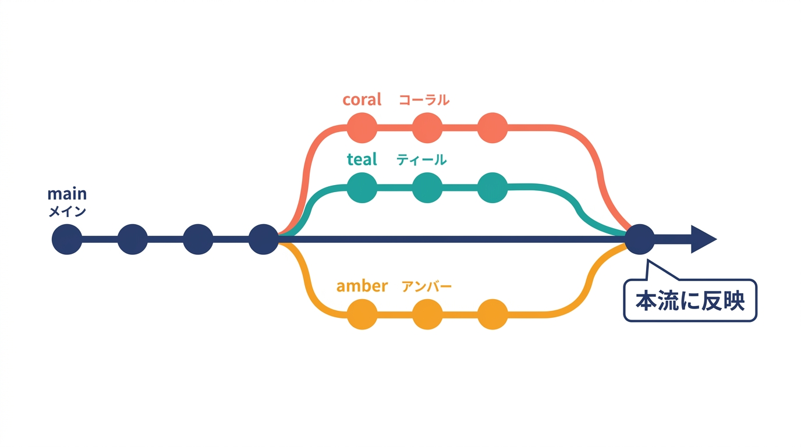
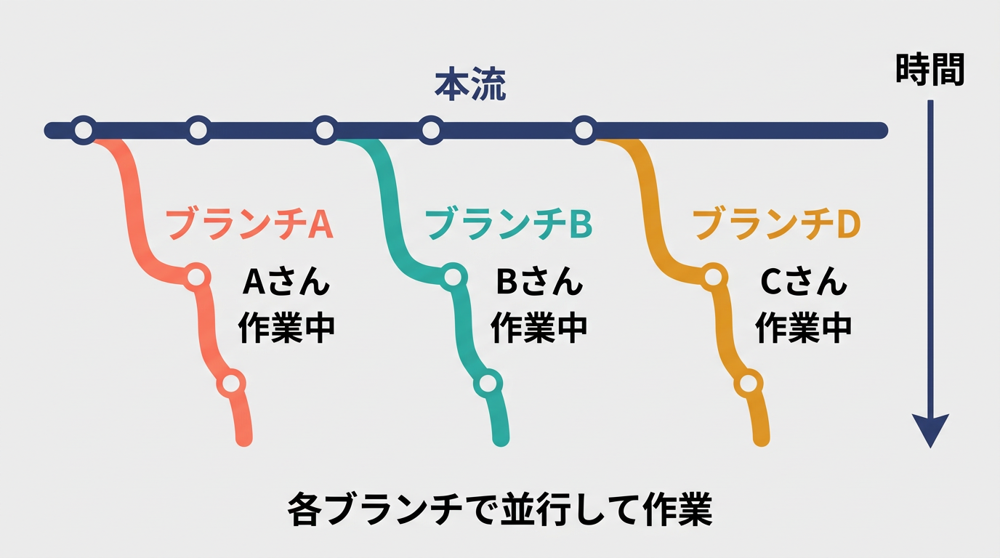
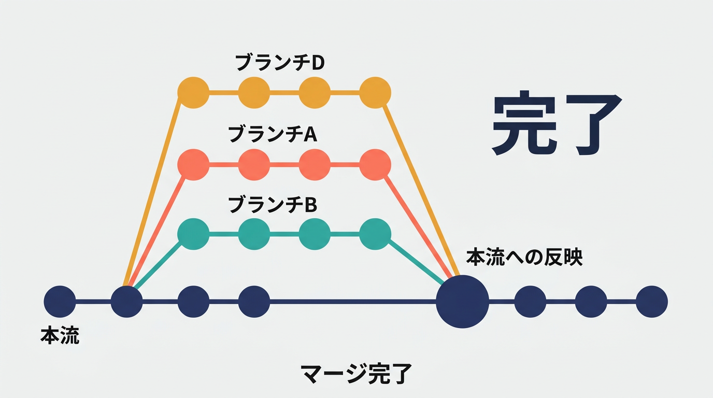

# Gitとは何か～覚書

前職は閉ざされた環境で仕事をしていた関係上、Gitに触れることなく仕事をしてきました。

現職はオープンな環境のため、当然Gitを扱っております。30代半ばでようやく本格的にGitに触れるようになりました。

ただ、Gitという言葉は知ってはいるものの、詳細についてはほとんど知識がない状態でしたので、調べてみました。

> Git（ギット）は、プログラムのソースコードなどの変更履歴を記録・追跡するための分散型バージョン管理システムである（出典：Wikipedia）

分散型とは、各開発者がローカルに履歴のコピーを持つため、オフラインでも作業が可能という特徴があります。1人で小規模なシステムを作るくらいならなくても一応開発は可能ですが、複数人になると途端に難しくなります。（1人で開発する場合でも、使っておくに越したことはありません）

前職ではデータ移行ツールを頻繁に作っていたのですが、デバッグを繰り返していくうちに、自分が何を直したのかがわからなくなります。その場ではわかっていても、作業範囲が広くなるにつれ、過去の修正内容は記憶が曖昧になってきます。

頑張ってコメントは残すのですが、それにも限界があり、ふと気づくと「あれ？これっていつどのタイミングで直した…？」となることがあります。

複数人で開発する場合は、他人もソースを作成・修正するため、把握できるわけがありません。その点を補ってくれるのがGitの利点です。

## バージョン管理

また、Gitはバージョン管理もできる点が優れています。修正を重ねるうちに行き詰まってしまい、「前のバージョンに戻した方が早い」と思うことは多々あります。

Gitを利用していない場合、運よく前のソースを退避していればまだよいのですが、そうでなかった場合、「どこを直したっけ…」と地獄を見る羽目になります。

その点、Gitにはバージョンを戻す機能があるため、行き詰まった場合でもそこからやり直すことは簡単にできます。

## ブランチ機能

もう一つ、Gitにはブランチという機能があります。ブランチは branch（枝）の意味で、本流（幹）に対して枝となるブランチを作成し、並行して作業できるようにする機能です。

### 例：システムの画面

例えば以下のようなシステムの画面です。

これに対して、以下のような複数の対応が必要になったとします。

これに対して、3人で以下のように分担して対応します。

- A機能の不具合対応：Aさん
- B機能の改修対応：Bさん
- D機能の追加対応：Cさん

### Gitを用いない場合

Gitを用いない場合は、1つのソースに対して3人で修正を行うことになります。

このままでは互いの更新が競合することになり、作業効率が下がってしまいます。

### Gitでブランチを分ける場合

それに対してGitでは、元のソースを本流（マスター／メインブランチ。現在は main と呼ばれることが多い）として、ブランチを作成することができます。

各ブランチのソースをそれぞれが更新することで、並行作業を実現できます。

最後に、それぞれのブランチの修正を本流に反映させる（マージする）ことで、作業が完了します。

## まとめ

このようにGitには

- コードの変更履歴の管理
- 問題が発生した際の巻き戻し
- 複数の機能開発の並行作業

といった、1人開発でもチーム開発でも効率的な作業を可能にする機能を備えております。
